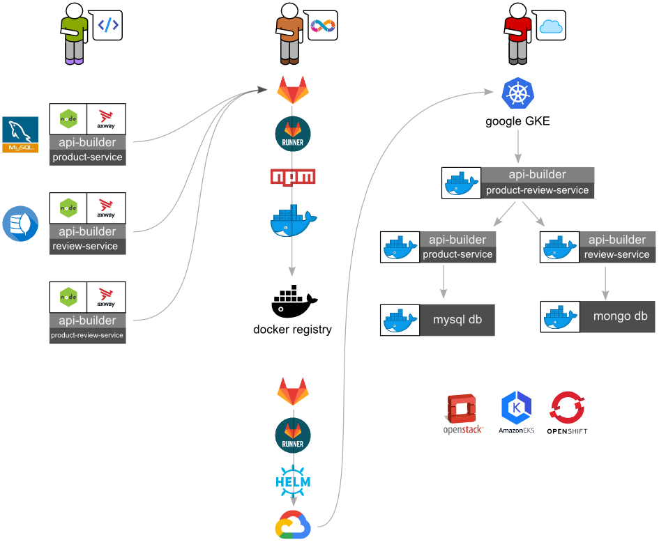

# What is New?

## Headlines

1. No dependency on ARS or AppC. 
1. New CLI - @axway/api-builder
1. Introduced new plugin architecture leveraging npm modules:
    * Data connectors are installed as npm modules (plugins)
    * Service connectors are installed as npm modules (plugins)
    * Flow-nodes are installed as npm modules (plugins)
1. New flow nodes:
    * Added new asynchronous HTTP rest client plugin to the flow
    * Added new asynchronous Swagger plugin to the flow
1. Logging to stdout to allow for integration with 3rd party log aggregators.
1. Revised configuration to have only `default` and `local` sets of configuration files

### Standalone

API Builder is now standalone and no longer requires `appc`, or the Appcelerator cloud.  API Builder is a **free** NodeJS / ExpressJS application to help companies rapidly build microservices using reusable components, and then build these services into containers to deploy into any container platform.  API Builder is not a container itself.

### DevOps

API Builder is now standalone and is not opinionated about how or where your microservices are deployed. API Builder helps you rapidly develop microservices that you can then integrate into your standard DevOps build system and deploy to the environment of your choosing.

### Plugin Architecture

Previously, API Builder needed appc CLI to download connectors from Appcelerator cloud.  Now, API Builder will load all of its components from npm node modules.  A 12-factor app needs to [explicitly declare and isolate dependencies](https://12factor.net/dependencies).  The node modules are **plugins** for API Builder, and can extend functionality, such as adding data connectors, or flow-nodes to the flow editor. 

The API Builder 3.x data connectors are not compatibile with the new plugin architecture. API Builder 4 Standalone GA'ed with support for 3 data connectors:

* @axway/api-builder-plugin-dc-mongo
* @axway/api-builder-plugin-dc-mysql
* @axway/api-builder-plugin-dc-oracle

This list will be expanded on an as-needed basis.

### Custom flow-node plugins

The ability to create custom robust, reusable, and pluggable flow-nodes is an important aspect to API Builder.  In this version of the product, they are now plugins and loaded from node_modules.  Use the [axway-flow-sdk](https://www.npmjs.com/package/axway-flow-sdk) to create custom plugins.

#### HTTP REST client flow-node

API Builder now has a new flow-node that can connect to external services asynchronously via HTTP.

#### Swagger flow-node

API Builder now has a new flow-node that can load Swagger 2.0 documents as flow-nodes and make them available to the flow editor.  This greatly simplifies orchestrating east-west communication to sibling services in a service mesh.

### Logging

Previously, API Builder wrote to a logs directory.  Now, it only streams to stdout.  To be amenable to 12-factor application to [treat logs as event streams](https://12factor.net/logs), applications should not log to file.

### Configuration

Previously, API Builder had specific configuration files per-environment.  Now, API Builder has simplified configuration with two sets of configuration files called `default` and `local`.  A 12-factor application should be [environment agnostic](https://12factor.net/config) so the environment specific configuration sets (e.g. `production` were removed).  Furthermore, the recommended way to [keep environments as similar as possible](https://12factor.net/dev-prod-parity), is to use OS environment variables (i.e. `process.env`), e.g. for [port binding](https://12factor.net/port-binding), authentication settings, remote host settings, etc.

### Reading Next

[Chapter 01. Demo Setup](../01_demo_setup)

[Chapter 02. Create Microservice from a Database](../02_microservice_from_db)

[Chapter 03. Consume External Services](../03_external_services)

[Chapter 04. Containerization](../04_containerization)

[Chapter 05. Scalable Deployments (with Kubernetes)](../05_kubernetes)