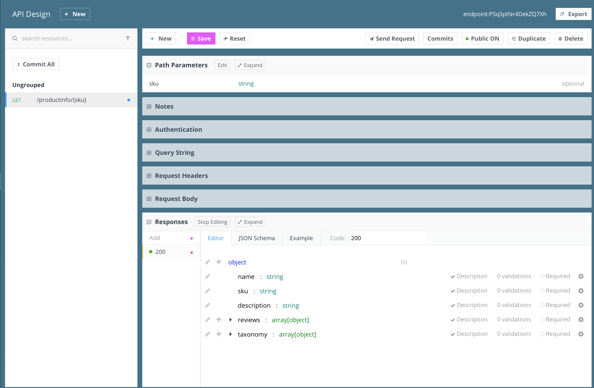

# Product-Review Microservice

This folder contains example for API Bulder microservice that leverages other API Builder microservices and external APIs. The folder contains:

* `microservice-spec.json` - the microservice specification described in Swagger 2.0 standard
* `microservice-src` - the source code of the microservice

The service aggregates information from the following services:

## Internal 
* `product-service` - API Builder microservice that gets data from MySQL database
* `review-service` - API Builder microservice that gets data from MongoDB database

## External
* `Taxonomy API` - Use a single endpoint to get taxonomy on the provided text. In our use case we are getting possible product classifications based on the product description (this functionality leverage Parallel Dots API)

## Architecture Diagram

## How to Try?

TODO: Explain how to run already created service

## How to Build on Your Own?

This section explains how to build on your own the microservice that is available in `micorservice-src` folder.

### Step 1 - Scaffold The Application

See the startup guide

### Step 2 - Create your API Spec

As long as you know your business logic many alternative ways exist to create your API specification. This also depends on the specification format you prefer. However, API Buider works with Swagger 2.0 so this format will be used for the case of the demo.

One of the available tools out there is Stoplight. It can be used to define the API and export the swagger specification. Sample screenshot is shown bellow.

### Step 3 - Import the specification to API Builder service

* Run your API Builder service

* Open the API Builder administration UI

* Import the swagger created on the previous step

This will relaod your application and you will have API with a single endpoint that is still not activated. The reason is that associated flow for this endpoint is still not created.

### Step 4 - Create a Flow to serve specific ednpoint

In the API Builder administration select the endpoint for which you want a flow. Clicking on the Create Flow will open the flow editor where the Flow can be designed.

And that is basically everything now we have a fully working API that could be tried out as explaned in the section How to Try?
