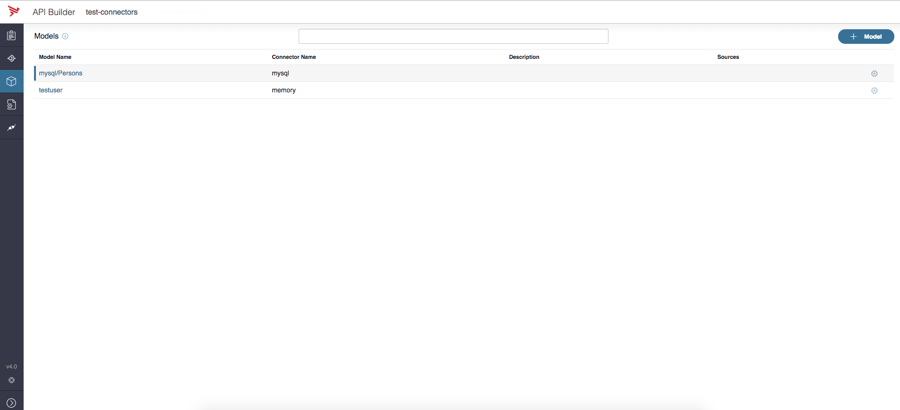
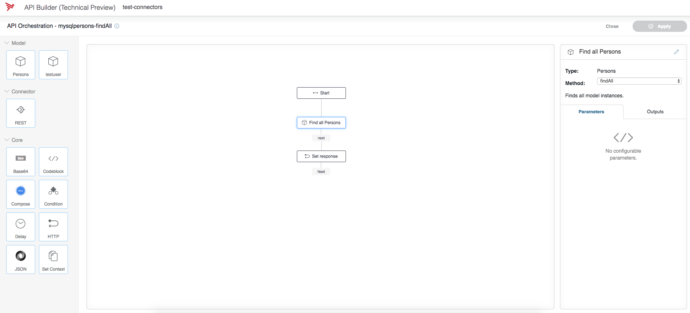

# Product Microservice

## Table of content
*	[Introduction](#introduction)
*	[Prerequisites](#prerequisites)
*	[Architecture and Dependencies](#architecture-and-dependencies)
*	[How to create own mysql container with DB](#how-to-create-own-mysql-container-with-db)

## Introduction
> This document provides information on how to configure and run an API Builder service within a connector.
 
## Prerequisites
Prior to setting up a project with a connector, refer to:

* [API Builder Getting Started Guide](https://wiki.appcelerator.org/display/AB4/API+Builder+Getting+Started+Guide) - Provides detailed instructions for installing API Builder and creating an API Builder project.
* [API Builder Project](https://wiki.appcelerator.org/display/AB4/API+Builder+Project) - Provides detailed information about API Builder projects and services.

## Architecture and Dependencies

### Internal
- product-service
 
### External
* [API Builder Connectors](https://wiki.appcelerator.org/display/AB4/API+Builder+Connectors) - configure and run an API Builder Service within a connector such as Oracle, MySQL, and MongoDB.

## How to create own Service with MySql container DB

This document provides a step-by-step tutorial on how to run an API Builder service within a connector in container with DB. These steps include:

### Create your API Builder project

* Create your API Builder service

* Add your connector

* Run your service

* These steps and their required prerequisites are described in the following sections.

### Prerequisites

You should have `NPM` latest version and `Node.js` latest version (^8) installed.
Tools to be installed in advance:

* Install the __API Builder Command Line Interface (CLI)__ globally using `npm`. It is a node module published in npm public repository, please find additional information on official API Builder Getting Started Guide.
* __Docker__ - The installation of Docker depends on the specific operating system, please read the details on the following page Read the official guide for Docker installation.
Research for the B.I tools and 3rd party data store i.e. Splunk, Elastic etc.

### Step 1: Create your API Builder service
If you already have a generated service, you can proceed to __Step 2__.
Install the API Builder Command Line Interface (CLI) globally using npm.

```sh
[sudo] npm install -g @axway/api-builder
```

Once API Builder CLI is installed, you can use it to create a new project.  In the following example, the CLI will create and initialize the `./<dir>` new project directory.

```sh
api-builder init <dir>
```

__NOTE:__ `<dir>` - The directory to initialize.

Then, install the project's dependencies and start the API Builder project.

```sh
cd ./<dir>
npm install --no-optional
npm start
```

Once your project is running, point your browser to http://localhost:8080/console to access the API Builder user interface (UI) console.

__NOTE:__ Refer to the [API Builder Getting Started Guide](https://wiki.appcelerator.org/display/AB4/API+Builder+Getting+Started+Guide) for detailed information.

### Step 2: Add your connector
Now, you have tested that your service is running directly on your machine.

In case, you need to stop the service, use `Ctrl + C` in your terminal where the service is running.

#### API Builder Connectors
Connectors are adapters to allow you to read and write data to and from an external data source, such as Oracle, MySQL,and MongoDB.  They give your application the ability to utilize existing data sources to create Models for use within your API Builder application, either directly as API, or within flows.

__NOTE:__ Refer to [API Builder Connectors](https://wiki.appcelerator.org/display/AB4/API+Builder+Connectors) for detailed information.

#### Available connectors
The following connectors are available for download directly from NPM:

* @axway/api-builder-plugin-dc-mongo
* @axway/api-builder-plugin-dc-mysql
* @axway/api-builder-plugin-dc-oracle

To add a Connector:

1. Install the Connector
1. Configure the Connector
1. Use the Connector

#### Step 2a: Install the Connector
To install a data connector, navigate to the root directory of your service and use the following command; for example,to install the MySQL data connector:

```sh
npm install @axway/api-builder-plugin-dc-<connector-name>
```

__NOTE:__ using `@latest` will pick up the latest available connector version. You will need to configure your connector with connection details before starting your application or it will fail to start. For additional configuration details, refer to the connector.

A configuration file is generated for you and placed into the conf directory of your API Builder project. By default we use a host of localhost, a user of root and a password of password to connect.

#### Step 2b: Configure the Connector
When you install a connector, it will create a configuration file located in the `<SERVICE_FOLDER>/conf` folder that has the name of your connector. For example, mysql.default.js. You will need to edit this file and give it the required connection details such as database host and port, user, password, and database.

The configuration files that can contain environment variables are placed in the `<SERVICE_FOLDER>/conf` folder.

All the variables in your configuration files taken from `process.env.<VARIABLE_NAME>` can be provided when running the Docker container.

The following table lists the configuration files, their location, and their example content. The connector configuration is shown to inform you that you will have to provide an additional set of environment variables when using an API Builder service with connectors.

| Configuration File                 | Location                                         | Example                          |
|:---------------------|:----------------------------------------------------|:---------------------------------|
| Service Configuration	| __<SERVICE_FOLDER>/conf/default.js__		| 	`module.exports = {` <br><span style="padding-left:3em"> `apiKey: process.env.APIKEY`</span> <br><span style="padding-left:3em"> `port: parseInt(process.env.PORT) || 8080 `</span><br> `};` |
| | | |
| Connector Configuration | __<SERVICE_FOLDER>/conf/mysql.default.js__ | `module.exports = {`<br><span style="padding-left:3em"> `connectors: {` </span> <br> <span style="padding-left:6em"> `mysql: {` </span> <br><span style="padding-left:9em"> `connector:` </span> <br> <span style="padding-left:12em"> `'@axway/api-builder-plugin-dc-mysql',`</span><br><span style="padding-left:12em">`connectionPooling: true,`<br><span style="padding-left:12em">`connectionLimit: 10,`<br><span style="padding-left:12em">`host: process.env.DB_HOST || 'localhost',`<br><span style="padding-left:12em">`port: 3306,`</span><br><span style="padding-left:12em">`database: process.env.DB_NAME || 'mysql',`</span><br><span style="padding-left:12em">`user: process.env.DB_USER,`</span><br><span style="padding-left:12em">`password: process.env.DB_PASSWORD,`</span><br><span style="padding-left:12em">`generateModelsFromSchema: true,`</span><br><span style="padding-left:12em">`modelAutogen: false`<br> </span> <span style="padding-left:6em">`}`</span><br> <span style="padding-left:3em">`}` </span><br> `};` <br>|

###### API Builder Models
Your connector tables will be listed uner the Models section of the console. You can now click on the gear icon to the right of the table names and generate flow based apis.

Once you've configured your MySQL configuration files located under `<dir>/conf` you can start up your API Builder project and visit the console (normally found under `localhost:8080/console`). Your connector will be listed under on the Connectors tab of the console.


Your MySQL tables will be listed under the Models tab of the console.



###### Using connector models in flows
To use the connector model in a flow, select the Flow icon for one of the generated endpoints for the connector; for example, for the Find all mysqlPersons endpoint. The API Orchestration page with all loaded connectors, flow-nodes, and so forth is displayed. For additional information on using a connector model in a flow, refer to [Manage Flows](https://wiki.appcelerator.org/display/AB4/Manage+Flows).



###### Using auto-generated model API
You can also reference the connector in a custom model.

```js
const Account = Arrow.Model.extend('Account', {
  fields: {
    Name: { type: String, required: true }
  },
  connector: '<connector-name>'
});
```

If you want to map a specific model to a specific table, use metadata. For example, to map the account model to
the table named accounts, set it such as:

```js
const Account = Arrow.Model.extend('account', {
  fields: {
    Name: { type: String, required: false, validator: /[a-zA-Z]{3,}/ }
  },
  connector: '<connector-name>',
  metadata: {
    'mysql': {
      table: 'accounts'
    }
  }
});
```

#### Step 2c: Use the Connector
The configuration files that can contain environment variables are placed in the `<my-project>/conf` folder.

All the variables in your configuration files taken from `process.env.<VARIABLE_NAME>` can be provided when running the Docker container.

The following table lists the configuration files, their location, and their example content. The connector configuration is shown to inform you that you will have to provide an additional set of environment variables when using an API Builder service with connectors.

###### API Builder Environment Variables
The `<dir>/conf/<connector>.default.js` & `<dir>/conf/default.js` contains different environment variables. This is a list of the common variables that you will need to set to use this service.

| Name                 | Description                                         | Default                          |
|:---------------------|:----------------------------------------------------|:---------------------------------|
| APIKEY | The API key for incoming requests to the service. | |
| PORT  | The port the service will be listening on. | 8080 |
| | | |
| DB_HOST	| The host running the service.		| localhost |
| DB_NAME         | The nameof the DB.    | productdb |
| DB_USER | The DB user. |  root |
| DB_PASSWORD | The user's password.  | password |

### Step 3: Run Connector via Docker
* Run latest version of Docker
* Pull Docker Image via Docker Hub

```sh
docker pull <docker-image>
```

* For the demonstration purpose, decide to start MySql in container and open the ports of physical machine
```sh
docker run -p 3306:3306 --name <container-name> -e MYSQL_ROOT_PASSWORD=<my-password> -d mysql:5
```

__NOTE:__ `MYSQL_ROOT_PASSWORD` variable is mandatory and specifies the password that will be set for the MySQL `root` superuser account. In the above example, it was set to `<my-password>`. The `<container-name>` is the name of your container i.e. mysql-db, mysql-container, etc.

* Set user and passward, execute the following command
```sh
docker exec -it <container-name> mysql -uroot -p<my-password>
```

* Create DB
```sh
CREATE DATABASE productdb;
```

* Use the newly created DB
```sh
USE productdb;
```

* Create table
```sh
CREATE TABLE products(
    ID INT NOT NULL AUTO_INCREMENT,
    sku nvarchar(255),
    name nvarchar(255),
    PRIMARY KEY(ID)
);
```

* Using the below command you can see listof the running containers and theirs IDs
```sh
docker ps
```

* You could start/stop the container via the Container ID
```sh
docker start/stop <container-ID>
```

#### Step 4: Run your service
Now, you are ready to start your service via
```sh
DB_USER=root DB_PASSWORD=password npm start
```

Once your project is running, point your browser to http://localhost:8080/console to access the API Builder user interface (UI) console. 

Then you could navigate thru the components. 
1. Navigate to the Connectors tab. A list of the available connectors is displayed.
1. Now, navigate to the Models tab. Click the Tools icon for the MySQL connector and select Generate endpoints to create the MySql endpoints.
1. Navigate to the API Doc & Test tab. A list of the API Endpoints is displayed.
1. Select mysql/products to display the list of the generated endpoints for the MySQL connector.
1. Select the Flow icon for one of the generated endpoints for the MySQL connector; for example, for the Find all mysqlPersons endpoint. The API Orchestration page with all loaded connectors, nodes, and so forth is displayed.

__NOTE:__ Refer to __API Builder Flows__ and __Manage Nodes__ for detailed information.


* Now, you could execute `curl` command to be sure that the service is running successfully, the DB is reached and return real data. Set up the `apikey` from the `<dir>/conf/default.js` and path to the endpoint.

```sh
curl -u <apikey> http://localhost:8080/api/endpoints/products
```

__NOTE:__ if you haven't any records in the DB yet, the response will be empty array i.e. `[]`


