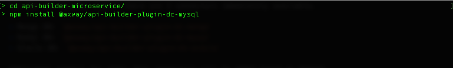
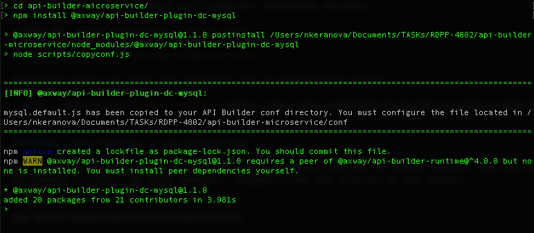
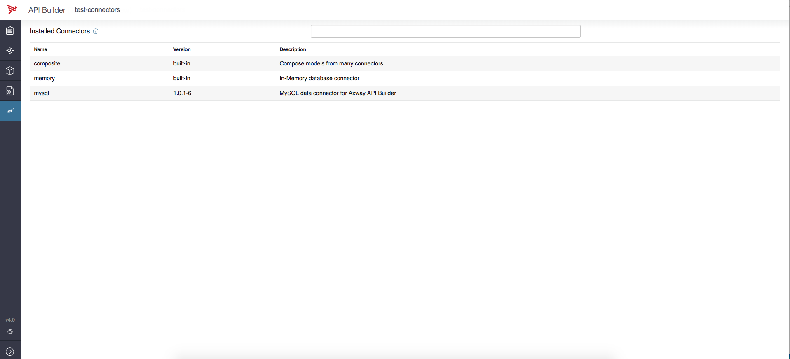
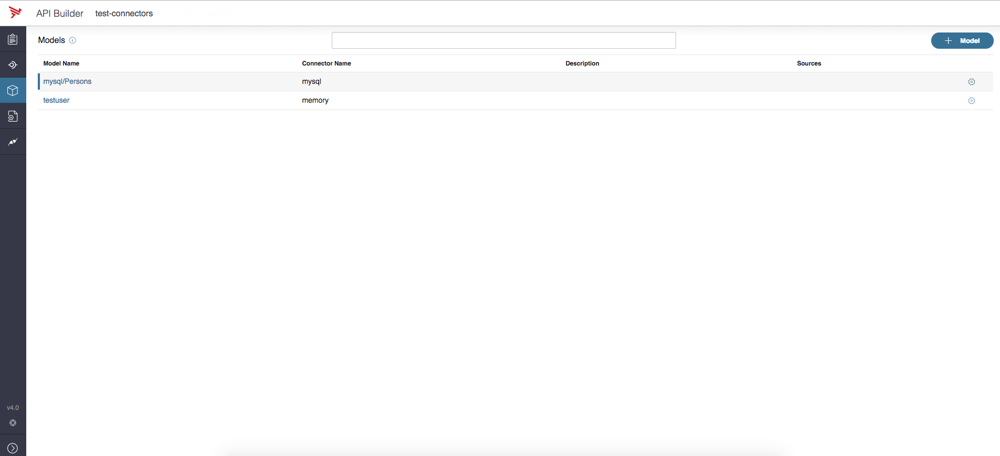
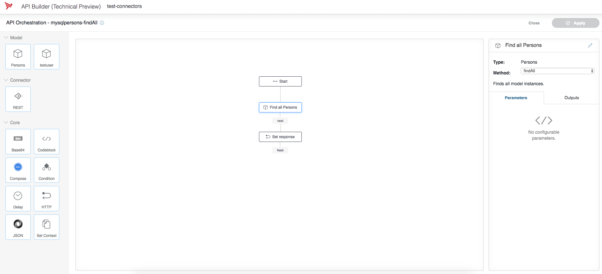

# How to make Microservice from DB

## Table of contents
*	[Introduction](#introduction)
*	[What are data connectors?](#what-are-data-connectors)
*	[Adding a Data Connector to your Microservice](#adding-a-data-connector-to-your-microservice)
*	[See Data Connectors in Action](#see-data-connectors-in-action)

## Introduction
The goal of this section is to show how to configure and run an API Builder Microservice within a Data Connector from DB.

## What are Data Connectors?

Data Connectors allow you to create microservices that can interact with the data in your existing RDBMS/NoSql datastores. They create Models based on the schema of your tables and collections and provide a standardized CRUD interface for interacting with them. This allows you to rapidly develop microservices that leverage your existing data using all the flexibility of orchestrated flows.

### What data connectors are available?
For the API Builder 4.0 GA there are 3 connectors immediately available.

* Mongo DB: `@axway/api-builder-plugin-dc-mongo`
* MySql DB: `@axway/api-builder-plugin-dc-mysql`
* Oracle DB: `@axway/api-builder-plugin-dc-oracle`

Additional support for other data connectors will be added based on demand.

__NOTE:__ Refer to [API Builder Connectors](https://docs.axway.com/bundle/API_Builder_4x_allOS_en/page/api_builder_connectors.html) for detailed information.

## Adding a Data Connector to your Microservice

Data connectors are API Builder plugins that can be installed into your API Builder project. They are regular NPM modules and are installed using _npm_. For example to install the MySql connector, navigate to the root directory of your project:

```sh
npm install @axway/api-builder-plugin-dc-mysql
```



Once the API Builder plugin was sucessfully installed, you will see the following information in your terminal:

```sh
> @axway/api-builder-plugin-dc-mysql@1.1.0 postinstall /Users/nkeranova/Documents/TASKs/RDPP-4802/api-builder-microservice/node_modules/@axway/api-builder-plugin-dc-mysql
> node scripts/copyconf.js


=====================================================================================
[INFO] @axway/api-builder-plugin-dc-mysql:

mysql.default.js has been copied to your API Builder conf directory. You must configure the file located in /Users/nkeranova/Documents/TASKs/RDPP-4802/api-builder-microservice/conf
=====================================================================================
```



### How do you configure them?
When you install a data connector, it will create a configuration file located in the `<dir>/conf` folder that has the name of your connector. For example, `mysql.default.js`. You will need to edit this file and give it the required connection details such as database host and port, user, password, and database.

The following is an example configuration file for MySql. Notice that, as with all configuration files, the data connector configuration can read values from the environment using the _process.env.NAME_ syntax. This will ensure you don't have to store sensitive information on disk.

#### Connector Configuration File
>__Location:__ `<dir>/conf/mysql.default.js`           

**_Example:_**
```js
module.exports = {
  connectors: {
    mysql: {
      connector: '@axway/api-builder-plugin-dc-mysql',
      connectionPooling: true,
      connectionLimit: 10,
      host: process.env.MYSQL_HOST || 'localhost',
      port: 3306,
      database: 'mysql',
      
      // This could be set to mysql since this is already available database by default
      database: 'mysql',
      user: process.env.MYSQL_USER,
      password: process.env.MYSQL_PASSWORD,
 
      // Create models based on your schema that can be used in your API.
      generateModelsFromSchema: true,
 
      // Whether or not to generate APIs based on the methods in generated models.
      modelAutogen: false
    }
  }
};
```

__NOTE:__ You will need to configure your connector with connection details before starting your application or it will fail to start. For additional configuration details, refer to the data connector's documentation.

Once you've configured your MySQL configuration files located under `<dir>/conf` you can start up your API Builder project and visit the console (normally found under `localhost:8080/console`). Your connector will be listed under on the Connectors tab of the console.



### API Builder Models
The data connector will create Models to represent the objects in it's schema. For an RDBMS database this is each table, for a NoSql this is each collection. These Models are visible in the the Models section of the console. 



You can generate a flow based CRUD API for each Model by click on the gear icon to the right of the table names and selecting generate flow based apis.

If the standard CRUD API is not sufficient to your business needs you import your own API definition and implement the business logic in a custom flow with full access to your models.


### How do you use them in your flow?
To use the model in a flow, select the Flow icon for one of the generated endpoints for the connector; for example, for the Find all mysqlPersons endpoint. The API Orchestration page with all loaded connectors, flow-nodes, and so forth is displayed. For additional information on using a connector model in a flow, refer to [Manage Flows](https://wiki.appcelerator.org/display/AB4/Manage+Flows).



### Run your data connector enabled Microservice
Now, you are ready to start your service via
```sh
MYSQL_USER=root MYSQL_PASSWORD=password npm start
```

Once your project is running, point your browser to http://localhost:8080/console to access the API Builder user interface (UI) console. 

Then you could navigate thru the components. 
1. Navigate to the Connectors tab. A list of the available connectors is displayed.
1. Now, navigate to the Models tab. Click the Tools icon for the MySQL connector and select Generate endpoints to create the MySql endpoints.
1. Navigate to the API Doc & Test tab. A list of the API Endpoints is displayed.
1. Select mysql/products to display the list of the generated endpoints for the MySQL connector.
1. Select the Flow icon for one of the generated endpoints for the MySQL connector; for example, for the Find all mysqlPersons endpoint. The API Orchestration page with all loaded connectors, nodes, and so forth is displayed.

__NOTE:__ Refer to __API Builder Flows__ and __Manage Nodes__ for detailed information.


* Now, you could execute `curl` command to be sure that the service is running successfully, the DB is reached and return real data. Set up the `apikey` from the `<dir>/conf/default.js` and path to the endpoint.

```sh
curl -u <apikey> http://localhost:8080/api/endpoints/<your-endpoint>
```

__NOTE:__ if you haven't any records in the DB yet, the response will be empty array i.e. `[]`

## See Data Connectors in Action

The are two service part of our demo that use data connectors. The can be found in [the `./project` folder of this repository](https://github.com/Axway/api-builder-standalone-tech-enablement/tree/master/project):

* **[Product Service](https://github.com/Axway/api-builder-standalone-tech-enablement/tree/master/project/product-service)** - used to access Product database from MySQL database via `@axway/api-builder-plugin-dc-mysql` plugin.
* **[Review Service](https://github.com/Axway/api-builder-standalone-tech-enablement/tree/master/project/review-service)** - used to access the Reviews database from MongoDB via `@axway/api-builder-plugin-dc-mongo` plugin.

### Reading Next

[Chapter 03. Consume External Services](../03_external_services)

[Chapter 04. Containerization](../04_containerization)

[Chapter 05. Demo Setup](../05_demo_setup)

[Chapter 06. Scalable Deployments (with Kubernetes)](../06_kubernetes)