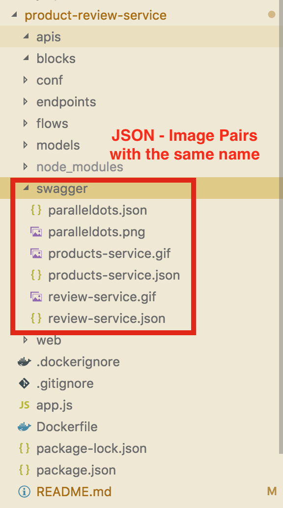
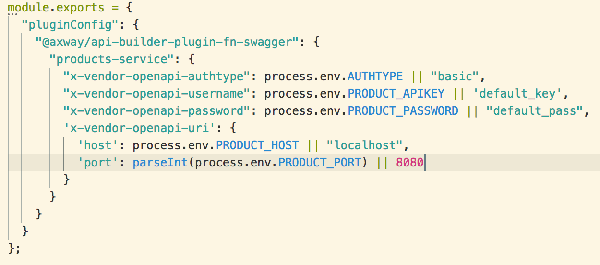
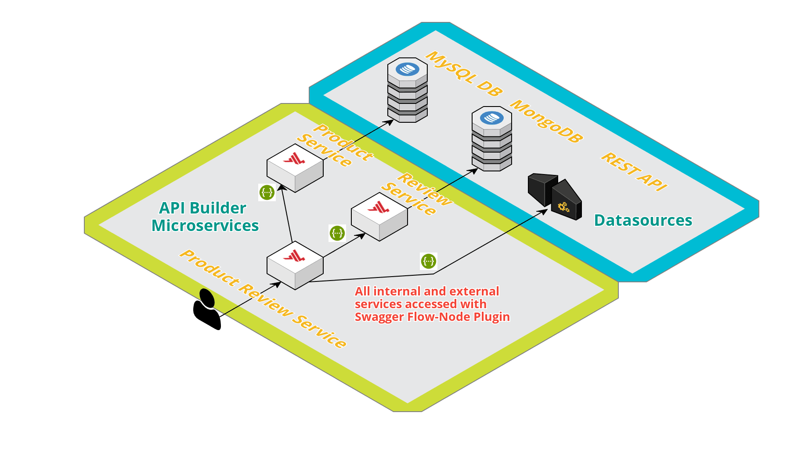

# Consume External Services

## Problem
We saw how easy it is to spin up an application and weave databases in your service with the help of Data Connectors plugins. However, these are not the only datasource types. In the age of API Economy there are many third party APIs that can be used as datasource. So the question is:

>**_How do we consume data from third-party APIs within API Builder service?_**

## The API Builder Solution
Currently API Builder offer solution that:
* Leverage the [Swagger 2.0 standard](https://swagger.io/docs/specification/2-0/basic-structure/) for API description
* Uses the [API Builder Swagger Flow-Node Plugin](https://www.npmjs.com/package/@axway/api-builder-plugin-fn-swagger) that is automatically listed as dependency on a newly scaffolded service.

## How it Works?

It is a simple 3 steps process:
1. Find an API and gets its Swagger description (or write your own)
2. Place the swagger into the service `./swagger` folder together with an icon with the same name

3. Configure the service within automatically generated file in the service `./conf` folder. Direct values or environmentalized values could be provided as shown bellow: 

### See it in Action 

The API Builder Swagger Flow-Node plugin can be seen in action in [Product Review Service](../project/product-review-service). It is used in this service for communication with 3 underlying services as shown on the diagram:

#### Internal Services (other API Builder Services)
* **[Product Service](../product-service)** - used to collect the Product Details
* **[Review Service](../review-service)** - used to collect the Reviews for Product

#### External Services (third-party APIs)
* **[Parallel Dots API](http://paralleldots.com)** - used to collect Taxonomy data based on Product description.

[Read Product Review Service documentation]((../project/product-review-service)) if you want to test it out.