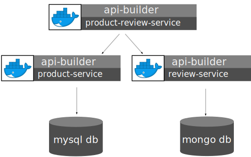
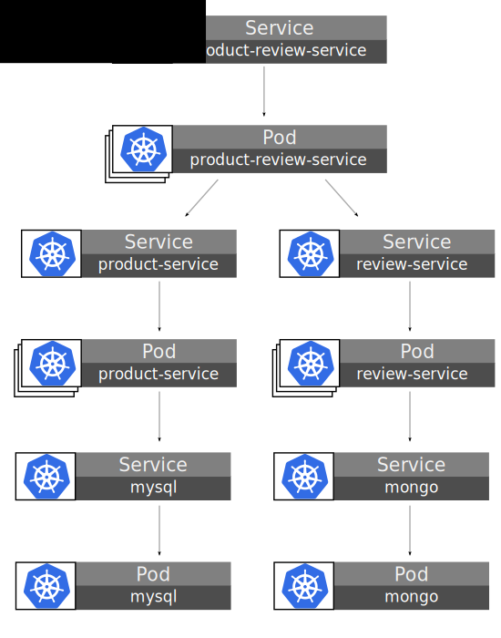
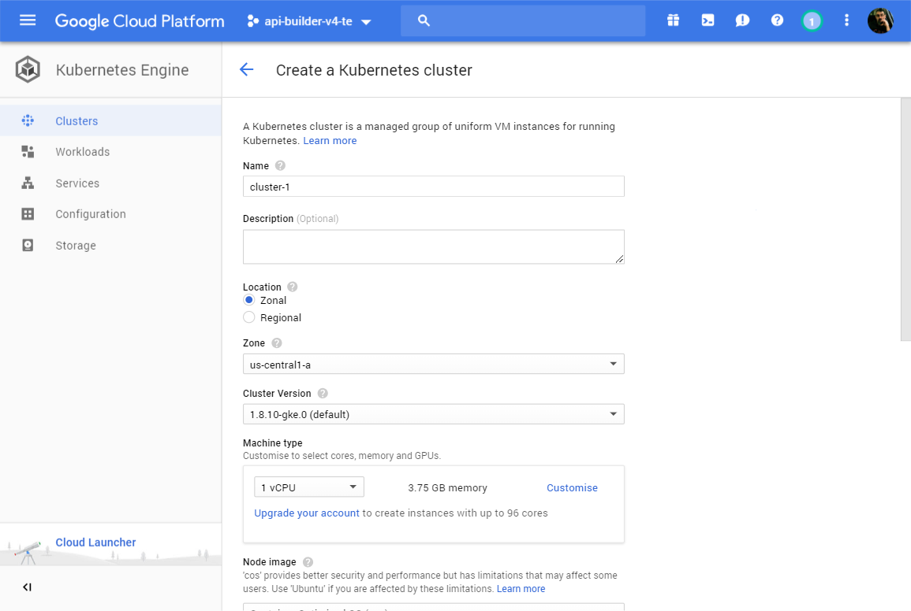
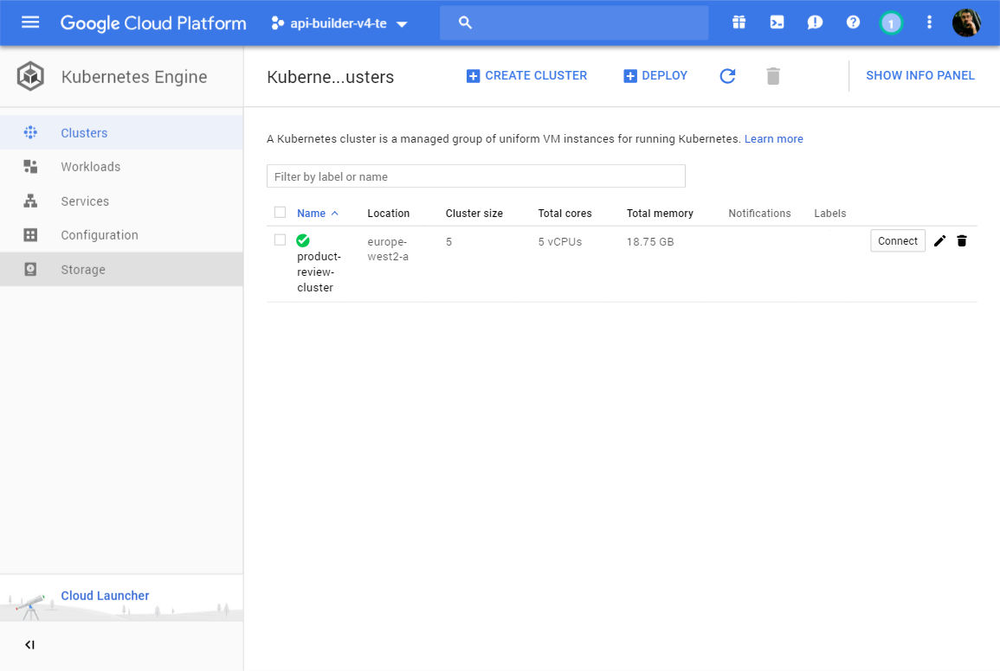

# Kubernetes ([https://kubernetes.io](https://kubernetes.io))

The goal of this section is to show how to deploy your services to Kubernetes. Kubernetes is a container orchestration system that automates deployment, scaling, management, etc of containerized applications.

The concepts we will be dealing with are:
- [Pods](https://kubernetes.io/docs/concepts/workloads/pods/pod/) are the smallest deployable units that can be created and managed. Each pod is a group of one or more containers.
- [Deployments](https://kubernetes.io/docs/concepts/workloads/controllers/deployment/) allow you to declaritively define the relationship between ReplicaSets and Pods.
- [Services](https://kubernetes.io/docs/concepts/services-networking/service/) are an abstraction which defines a logical set of Pods and a policy by which to access them.

> This is only a small subset of the features Kubernetes provides but sufficient for our demonstration.
 
## Product Review Service

The scenario we're using for this demostration comprises of 3 microservices and 2 datasources. 



> For this demostration we will also be hosting the databases in the Kubernetes cluster but in a real world situation these likely be hosted elsewhere (or at the very least have persistent storage and be scalable).

For the demo our pods will just contain a single service. If we were deploying a sidecar such as Istio then we'd also have Envoy in the pods. The `product-review-service` is the only microservice that will be accessible outside of the cluster. So perhaps a more accurate visualization of this is:



## Helm

To simplify/automate the deployment we'll use Helm. Helm is "the package manager for Kubernetes". A Helm _chart_ allows you to define, install and upgrade complex Kubernetes applications. 

To deploy/configure something in Kubernetes you create a YAML file describing the resource being deployed. For example:

```yaml
apiVersion: v1
kind: ServiceAccount
metadata:
  name: tiller
  namespace: kube-system
```

This YAML file describes a ServiceAccount, this is deployed using `kubectl`

```bash
$ kubectl create -f resource.yaml
```

However as your deployment gets larger and more complex this becomes quite hard to manage and automate. This is the problem Helm solves. It allows you to create logical groupings of your resource yaml files. These are known as _Charts_. Then to deploy your application it delivers the _chart_ and the values for the templates to a service running in your cluster called _Tiller_. Tiller then applies all the changes.

The templates in a chart can be parameterized, this means charts can be distributed and easily customized - only the _values.yaml_ file needs to be edited. For our demonstration, each of our microservices (and, for this demo, datastores too) will be deployed as pods with replicas using a _Deployement_ and also a _Service_ per deployment so that they can communicate.

## Google Kubernetes Engine (GKE)

There are an multipe cloud plaforms that provide support for Kubernetes orchestration, such as Amazon EKS, Azure Kubernetes Serivce and Google Kubernetes Engine. In this section we will look at how to deploy your application to the Google Kubernettes Engine (GKE). While some of the steps outlined here are GKE specific, in general the same topics will apply to all vendors.

### Setting up Google Kubernetes Engine (GKE)

> This is a brief overview of the steps to configure you machine to access GKE, however this is not an in-depth how-to guide. So for more information please consult the documentation [https://cloud.google.com/kubernetes-engine](https://cloud.google.com/kubernetes-engine).

GKE runs on the Google Cloud Platform (GCP), so the first step is to install the Google Cloud SDK (`gcloud`). This will be platform dependent, see [https://cloud.google.com/sdk/install](https://cloud.google.com/sdk/install).

#### Create a project

GCP resources are organized hierarchically. Starting from the bottom of the hierarchy, projects are the first level, and they contain other resources. All resources must belong to exactly one project. See [https://cloud.google.com/resource-manager/docs/cloud-platform-resource-hierarchy](https://cloud.google.com/resource-manager/docs/cloud-platform-resource-hierarchy) for more detail.

GCP/GKE has a rich UI and a lot of the tasks descibed here can also be achieved via the UI. To create a project you can go to [https://console.cloud.google.com/projectcreate](https://console.cloud.google.com/projectcreate). 

It can also be done from the command line using Google Cloud SDK (gcloud) we can also do it from the command line.

```bash
gcloud projects create rd-api-builder
```

You can view your projects:

```bash
$ gcloud projects list
PROJECT_ID      NAME            PROJECT_NUMBER
rd-api-builder  RD-API-BUILDER  599994285848
```

To make working with the gcloud cli simpler you can set defaults for your project and compute zones, rather than having to specify them on each command.

```bash
$ gcloud config set project rd-api-builder
Updated property [core/project].

$ gcloud config set compute/zone europe-west2-a
Updated property [compute/zone].
```

We're using the _europe-west2-a_ zone (London), a full list of the available zones/regions can be found [https://cloud.google.com/compute/docs/regions-zones/](https://cloud.google.com/compute/docs/regions-zones/).


#### Creating a cluster

A Kubernetes cluster is a managed group of uniform VM instances for running Kubernetes. These are the VMs that our application will be running on. Creating your cluster in the UI is the simplest option, [https://console.cloud.google.com/kubernetes/list](https://console.cloud.google.com/kubernetes/list).



However you can also create it from command line:

```bash
gcloud beta container clusters create "product-review-cluster" 
    --username "admin"
    --cluster-version "1.9.7-gke.3"
    --machine-type "n1-standard-1"
    --image-type "COS"
    --disk-type "pd-standard"
    --disk-size "100"
    --scopes "https://www.googleapis.com/auth/compute","https://www.googleapis.com/auth/devstorage.read_only","https://www.googleapis.com/auth/logging.write","https://www.googleapis.com/auth/monitoring","https://www.googleapis.com/auth/servicecontrol","https://www.googleapis.com/auth/service.management.readonly","https://www.googleapis.com/auth/trace.append"
    --num-nodes "5"
    --enable-cloud-logging
    --enable-cloud-monitoring
    --network "default"
    --subnetwork "default"
    --addons HorizontalPodAutoscaling,HttpLoadBalancing,KubernetesDashboard
    --no-enable-autoupgrade
    --enable-autorepair
```

You can list the available clusters:

```bash
$ gcloud beta container clusters list
NAME                    LOCATION        MASTER_VERSION  MASTER_IP      MACHINE_TYPE   NODE_VERSION  NUM_NODES  STATUS
product-review-cluster  europe-west2-a  1.9.7-gke.3     35.189.68.218  n1-standard-1  1.9.7-gke.3   5          RUNNING
```

Or view them in the UI:


### Configure kubectl

Once you have a project and a cluster created you need to configure _kubectl_ to use it. 

```bash
gcloud container clusters get-credentials product-review-cluster
```

You can verify it confugyred by ensuring you can see the Kubernetes services.

```bash
$ kubectl get svc --namespace kube-system
NAME                   TYPE        CLUSTER-IP      EXTERNAL-IP   PORT(S)         AGE
default-http-backend   NodePort    10.31.253.33    <none>        80:30164/TCP    2h
heapster               ClusterIP   10.31.251.150   <none>        80/TCP          2h
kube-dns               ClusterIP   10.31.240.10    <none>        53/UDP,53/TCP   2h
kubernetes-dashboard   ClusterIP   10.31.250.203   <none>        443/TCP         2h
```

### Configuring Helm ([https://helm.sh/](https://helm.sh/))

To install Helm on your platform see the installation instructions [https://github.com/kubernetes/helm#install](https://github.com/kubernetes/helm#install).

As mentioned earlier, Helm requires a service called _Tiller_ to be installed into your cluster to deploy _Charts_. On GKE this requires a service account with necessary role, for detail see [https://docs.helm.sh/using_helm/#gke](https://docs.helm.sh/using_helm/#gke).


```bash
$ kubectl create -f project/helm-setup/rbac-config.yaml
```

The you can install the Tiller service by doing:

```bash
$ helm init --service-account tiller
$HELM_HOME has been configured at /home/gavin/.helm.

Tiller (the Helm server-side component) has been installed into your Kubernetes Cluster.
Happy Helming!
```

If you now list the services in your cluster you will see a _tiller-deploy_.

```bash
$ kubectl get svc --namespace kube-system
NAME                   TYPE        CLUSTER-IP      EXTERNAL-IP   PORT(S)         AGE
default-http-backend   NodePort    10.31.253.33    <none>        80:30164/TCP    2h
heapster               ClusterIP   10.31.251.150   <none>        80/TCP          2h
kube-dns               ClusterIP   10.31.240.10    <none>        53/UDP,53/TCP   2h
kubernetes-dashboard   ClusterIP   10.31.250.203   <none>        443/TCP         2h
tiller-deploy          ClusterIP   10.31.253.1     <none>        44134/TCP       2h
```


## Building the images

Your DevOps process would be responsible for building and publishing the Docker images, but in this case we'll build the images locally.

```bash
docker build -t axway/api-builder-v4-demo-mysql project/mysql
docker build -t axway/api-builder-v4-demo-mongo project/mongo
docker build -t axway/api-builder-v4-demo-review project/review-service
docker build -t axway/api-builder-v4-demo-product project/product-service
docker build -t axway/api-builder-v4-demo-product-review project/product-review-service
```

For GKE we are going to push the images to the Google Container Registy (GCR). See [https://cloud.google.com/container-registry/docs/pushing-and-pulling](https://cloud.google.com/container-registry/docs/pushing-and-pulling).

```bash
docker tag axway/api-builder-v4-demo-mysql gcr.io/rd-api-builder/axway/api-builder-v4-demo-mysql
docker tag axway/api-builder-v4-demo-mongo gcr.io/rd-api-builder/axway/api-builder-v4-demo-mongo
docker tag axway/api-builder-v4-demo-review gcr.io/rd-api-builder/axway/api-builder-v4-demo-review
docker tag axway/api-builder-v4-demo-product gcr.io/rd-api-builder/axway/api-builder-v4-demo-product
docker tag axway/api-builder-v4-demo-product-review gcr.io/rd-api-builder/axway/api-builder-v4-demo-product-review
docker push gcr.io/rd-api-builder/axway/api-builder-v4-demo-mysql
docker push gcr.io/rd-api-builder/axway/api-builder-v4-demo-mongo
docker push gcr.io/rd-api-builder/axway/api-builder-v4-demo-review
docker push gcr.io/rd-api-builder/axway/api-builder-v4-demo-product
docker push gcr.io/rd-api-builder/axway/api-builder-v4-demo-product-review
```


## Installing the Demo

```bash
helm install --name demo project/helm-product-review-chart
```

