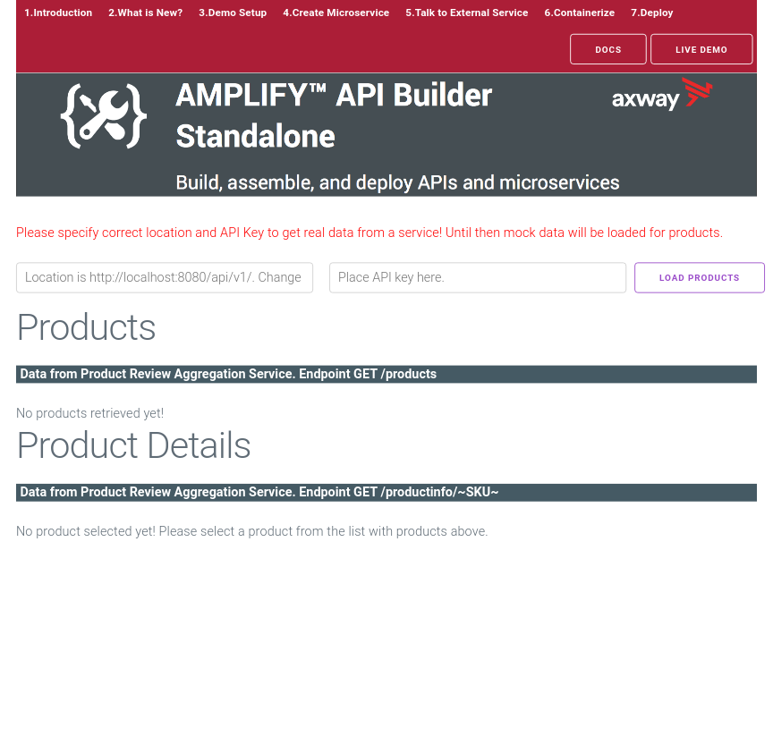
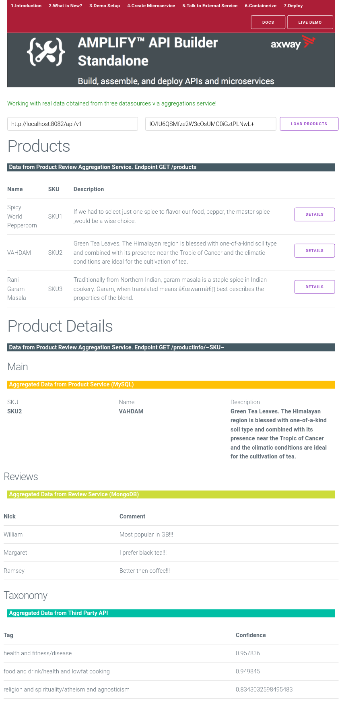

# API Builder Standalone Tech Enablement Demo

## The Demo Project

There is a completed suite of API Builder projects in the [project](../project/) folder. These address the business case described in [Chapter 01. Monolith to Microservices](../01_demo_scenario).


### Datastores

For simplicilty this demo has preconfigured containers for the datastores, in the real world the microservices would be connecting to your enterprise database. This demo contains two datastore containers:

* MySql ([/project/mysql](../project/mysql))
    The database is named _productdb_ and contains a single table _products_. This data is owned by the _Product Service_.
* MongoDB ([/project/mongo](../project/mongo))
    The database is named _admin_ and contains a single collection called _review_. This data is owned by the _Review Service_.

The default credentials for the databases are:
* MySql: apibuilder/apibuilder (or root/password)
* MongoDB: apibuilder/apibuilder

### Microservices

The demo consists of 3 services:

#### [Product Service](../project/product-service)

This microservice owns the product data in the MySql _productdb_. It provides two APIs for accessing the data:
* Find All (*GET /api/endpoints/products*)
* Find By SKU (*GET /api/endpoints/products/:sku*)

These are implemented using orchestrated flows as discussed in [Chapter 02. Create Microservice from a Database](../02_microservice_from_db).

The configuration is environmentalized as discussed in [Chapter 04. Containerization](../04_containerization), and it require the database details to be set.


#### [Review Service](../project/review-service)

This microservice owns the review data in the Mongo _admin_ database. It provides a single API for accessing the data:

* Find By SKU (*GET /api/endpoints/review/:sku*)

These are implemented using orchestrated flows as discussed in [Chapter 02. Create Microservice from a Database](../02_microservice_from_db).

The configuration is environmentalized as discussed in [Chapter 04. Containerization](../04_containerization), and it require the database details to be set.


#### [Product Review Service](../project/product-review-service)

In a real solution the _Product Review Service_ would be you _backend for frontends_ - it is the external API for clients to connect to. This microservice will aggregate the data from the _Review Service_ and the _Product Service_. Also to illustrate how the flow based orchestration can be leveraged to add additional value it will also connect out to a 3rd party service _Parallel Dots_ to get addtional information for the response.

It provides a 2 APIs for accessing the data:

* Find All Products (*GET /api/v1/products*)
* Find By SKU (*GET /api/v1/productinfo/:sku*)

Before proceeding you need to sign up and get an API Key from Parallel Dots [http://www.paralleldots.com](https://user.apis.paralleldots.com/signing-up?utm_source=website&utm_medium=homepage&utm_campaign=signup).

Also as this service is aggeragting data from the other microservices it requires details of how to connect to those services. The environment variables expected are:

| Env        | Description           | Value  |
| ------------- | ------------- | -----|
| PD_APIKEY       | The Parallel Dots API key. | _your own key_ |
| PRODUCT_HOST | The host running the _Product Service_ | localhost |
| PRODUCT_PORT | The port _Product Service_ is listening on | 8080 |
| PRODUCT_APIKEY | The API key of the _Product Service_ | jEeLFb2xjLQNxKBJBf89tEl+aL8+nj1X |
| REVIEW_HOST | The host running the _Review Service_ | localhost |
| REVIEW_PORT | The port _Review Service_ is listening on | 8080 |
| REVIEW_APIKEY | The API key of the _Product Service_ | CI5Uaei7o3AqI/J85trGCkYEjY/R7Q0v |


## Building the containers

All the services have been prepared for containerization and have standard Dockerfiles.

```bash
docker build -t axway/api-builder-v4-demo-mysql project/mysql
docker build -t axway/api-builder-v4-demo-mongo project/mongo
docker build -t axway/api-builder-v4-demo-product project/product-service
docker build -t axway/api-builder-v4-demo-review project/review-service
docker build -t axway/api-builder-v4-demo-product-review project/product-review-service
```

## Running the demo

For convenience we will use _docker-compose_ to start up the containers locally. 

> Instructions on installing _docker-compose_ can be found at [https://docs.docker.com/compose/install/](https://docs.docker.com/compose/install/)

> The container build is a *production* build and will not have the API Builder Console. When in development you probably would want to run the services as local applications rather than in containers.

```bash
docker-compose -f 05_demo_setup/docker-compose.yaml up
```

### Testing the services

Get the IP addresses of the containers:
```bash
docker inspect -f '{{range .NetworkSettings.Networks}}{{.IPAddress}}{{end}}' 05_demo_setup_review_1
docker inspect -f '{{range .NetworkSettings.Networks}}{{.IPAddress}}{{end}}' 05_demo_setup_product_1
docker inspect -f '{{range .NetworkSettings.Networks}}{{.IPAddress}}{{end}}' 05_demo_setup_product-review_1
```

#### Review
```bash
$ curl -u CI5Uaei7o3AqI/J85trGCkYEjY/R7Q0v: http://172.18.0.4:8080/api/endpoints/review/SKU1
"{\"id\": \"5b46249ba5b76d836bfb929d\",\"sku\": \"SKU1\",\"reviews\": [{\"review\":\"Best taste ever!!!\",\"user\":\"John\"},{\"review\":\"Had better meals!!!\",\"user\":\"Jack\"},{\"review\":\"Too spicy!!!\",\"user\":\"Jane\"}]}"
```

#### Product
```bash
$ curl -s -u jEeLFb2xjLQNxKBJBf89tEl+aL8+nj1X: http://172.18.0.5:8080/api/endpoints/products | jq
[
  {
    "id": 1,
    "sku": "SKU1",
    "name": "Spicy World Peppercorn",
    "description": "If we had to select just one spice to flavor our food, pepper, the master spice ,would be a wise choice."
  },
  {
    "id": 2,
    "sku": "SKU2",
    "name": "VAHDAM",
    "description": "Green Tea Leaves. The Himalayan region is blessed with one-of-a-kind soil type and combined with its presence near the Tropic of Cancer and the climatic conditions are ideal for the cultivation of tea."
  },
  {
    "id": 3,
    "sku": "SKU3",
    "name": "Rani Garam Masala",
    "description": "Traditionally from Northern Indian, garam masala is a staple spice in Indian cookery. Garam, when translated means “warm†best describes the properties of the blend. "
  }
]
```

#### Product Review
```bash
$ curl -s  -u IO/lU6QSMfze2W3cOsUMC0iGztPLNwL+: http://172.18.0.6:8080/api/v1/productinfo/SKU1 | jq
{
  "sku": "SKU1",
  "name": "Spicy World Peppercorn",
  "description": "If we had to select just one spice to flavor our food, pepper, the master spice ,would be a wise choice.",
  "reviews": [
    {
      "review": "Best taste ever!!!",
      "user": "John"
    },
    {
      "review": "Had better meals!!!",
      "user": "Jack"
    },
    {
      "review": "Too spicy!!!",
      "user": "Jane"
    }
  ],
  "taxonomy": [
    {
      "confidence_score": 0.98999,
      "tag": "food and drink/food"
    },
    {
      "confidence_score": 0.973018,
      "tag": "shopping/gifts"
    },
    {
      "confidence_score": 0.972578,
      "tag": "style and fashion/accessories"
    }
  ]
}
```

### UI Frontend

The project also includes an example UI application that invokes the _Product Review Service_ APIs, the [project/demo-ui](../project/demo-ui). To launch:

```bash
npm run demo
```



Fill in the URL for the API - http://172.18.0.6:8080/api/v1/ and the API Key for the _Products Review Service_ *IO/lU6QSMfze2W3cOsUMC0iGztPLNwL+*. Clicking _Load Products_ will call the _/api/v1/products_ endpoint, and then drilling down on the details will call the _/api/v1/productinfo/:sku_ endpoint.



### Reading Next

[Chapter 06. Scalable Deployments (with Kubernetes)](../06_kubernetes)