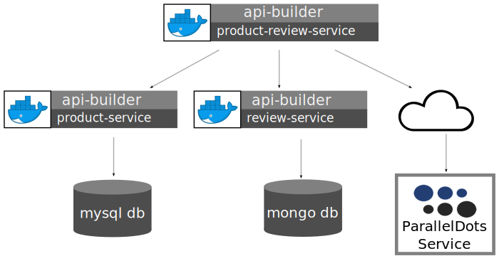

# API Builder Standalone Tech Enablement Demo

## The Demo Project

There is a completed suite of sample projects in the [project](../project/) folder.



### Datastores

For simplicilty this demo has preconfigured containers for the datastores, in the real world the microservices would be connecting to your enterprise database. This demo contains two datastore containers:

* MySql ([/project/mysql](../project/mysql))
    The database is named _productdb_ and contains a single table _products_. This data is owned by the _Product Service_.
* MongoDB ([/project/mongo](../project/mongo))
    The database is named _admin_ and contains a single collection called _review_. This data is owned by the _Review Service_.

Building the database containers:

```bash
docker build -t axway/api-builder-v4-demo-mysql project/mysql
docker build -t axway/api-builder-v4-demo-mongo project/mongo
```

Running the database containers (for debug purposes it can be useful to not run these as daemons):
```bash
docker run -it --name mysql axway/api-builder-v4-demo-mysql
docker run -it --name mongo axway/api-builder-v4-demo-mongo
```

The default credentials for the databases are:
* MySql: apibuilder/apibuilder (or root/password)
* MongoDB: apibuilder/apibuilder

To get the IP address of a running container:

```bash
docker inspect --format '{{ .NetworkSettings.IPAddress }}' mysql
docker inspect --format '{{ .NetworkSettings.IPAddress }}' mongo
```

### Microservices

The demo consists of 3 services:

#### [Product Service](../project/product-service)

This microservice owns the product data in the MySql _productdb_. It provides two APIs for accessing the data:
* Find All (*GET /api/endpoints/products*)
* Find By SKU (*GET /api/endpoints/products/:sku*)

These are implemented using orchestrated flows as discussed in [Chapter 02. Create Microservice from a Database](../02_microservice_from_db).

The configuration is environmentalized as discussed in [Chapter 04. Containerization](../04_containerization), and it require the database details to be set.

To run the _Product Service_ and connect to the containerized MySql database:

```bash
npm install
DB_HOST=172.17.0.2 DB_USER=apibuilder DB_PASSWORD=apibuilder node .
```

#### [Review Service](../project/review-service)

This microservice owns the review data in the Mongo _admin_ database. It provides a single API for accessing the data:

* Find By SKU (*GET /api/endpoints/review/:sku*)

To run the _Review Service_ and connect to the containerized Mongo database:

```bash
npm install
PORT=8081 DB_HOST=172.17.0.3 DB_USER=apibuilder DB_PASSWORD=apibuilder node .
```

> If running _Product Service_ and _Review Service_ on the same host they can also take a _PORT_ environment variable to configure what port they run on.

#### [Product Review Service](../project/product-review-service)

In a real solution the _Product Review Service_ would be you _backend for frontends_ - it is the external API for clients to connect to. This microservice will aggregate the data from the _Review Service_ and the _Product Service_. Also to illustrate how the flow based orchestration can be leveraged to add additional value it will also connect out to a 3rd party service _Parallel Dots_ to get addtional information for the response.

It provides a 2 APIs for accessing the data:

* Find All Products (*GET /api/v1/products*)
* Find By SKU (*GET /api/v1/productinfo/:sku*)

Before proceeding you need to sign up and get an API Key from Parallel Dots [http://www.paralleldots.com](https://user.apis.paralleldots.com/signing-up?utm_source=website&utm_medium=homepage&utm_campaign=signup).

Also as this service is aggeragting data from the other microservices it requires details of how to connect to those services. The environment variables expected are:

| Env        | Description           | Value  |
| ------------- | ------------- | -----|
| PD_APIKEY       | The Parallel Dots API key. | _your own key_ |
| PRODUCT_HOST | The host running the _Product Service_ | localhost |
| PRODUCT_PORT | The port _Product Service_ is listening on | 8080 |
| PRODUCT_APIKEY | The API key of the _Product Service_ | jEeLFb2xjLQNxKBJBf89tEl+aL8+nj1X |
| REVIEW_HOST | The host running the _Review Service_ | localhost |
| REVIEW_PORT | The port _Review Service_ is listening on | 8081 |
| REVIEW_APIKEY | The API key of the _Product Service_ | CI5Uaei7o3AqI/J85trGCkYEjY/R7Q0v |

As a single (very long command) this is:

```bash
PORT=8082 PD_APIKEY=your_pd_key \
PRODUCT_HOST=localhost PRODUCT_PORT=8080 PRODUCT_APIKEY=jEeLFb2xjLQNxKBJBf89tEl+aL8+nj1X \
REVIEW_HOST=localhost REVIEW_PORT=8081 REVIEW_APIKEY=CI5Uaei7o3AqI/J85trGCkYEjY/R7Q0v \
node .
```

At this point you can connect to the API Builder Console for the _Product Review Service_ [http://localhost:8082/console](http://localhost:8082/console) and test the APIs.

### Frontend

The project also includes an example UI application that invokes the _Product Review Service_ APIs, the [project/demo-ui](../project/demo-ui). To launch:

```bash
npm run demo
```


Fill in the URL for the API - http://localhost:8082/api/v1 and the API Key for the _Products Review Service_ *IO/lU6QSMfze2W3cOsUMC0iGztPLNwL+*. Clicking _Load Products_ will call the _/api/v1/products_ endpoint, and then drilling down on the details will call the _/api/v1/productinfo/:sku_ endpoint.


### Reading Next

[Chapter 06. Scalable Deployments (with Kubernetes)](../05_kubernetes)